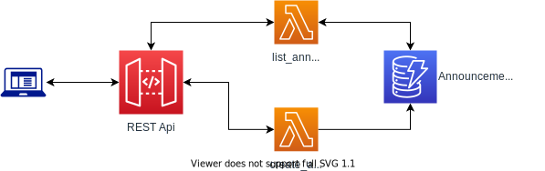

# Announcement microservice application


The application consists of:
* 1 AWS REST Api Gateway
* 2 Lambdas
* 1 DynamoDB table

# Prerequisites
* AWS account
* aws-cli installed on your host and configured

The instruction below is for Unix based systems

# How to deploy using cloudformation
1. Clone the repo
```
git clone https://github.com/vadymbat/aws-serverless-announcement-microservice.git \
    && cd aws-serverless-announcement-microservice
```

2. Configure access to AWS
```
export AWS_DEFAULT_REGION='eu-central-1'
export AWS_ACCESS_KEY_ID=''
export AWS_SECRET_ACCESS_KEY=''
export AWS_SESSION_TOKEN=''
```

3. Deploy the application
```
bash -e deploy.sh
```

# How to remove the resources after cloudformation
1. Configure access to AWS
```
export AWS_DEFAULT_REGION='eu-central-1'
export AWS_ACCESS_KEY_ID=''
export AWS_SECRET_ACCESS_KEY=''
export AWS_SESSION_TOKEN=''
```

2. Run cleanup script
```
bash -e cleanup.sh
```

# How to deploy using terraform
1. Clone the repo
```
git clone https://github.com/vadymbat/aws-serverless-announcement-microservice.git \
    && cd aws-serverless-announcement-microservice/terraform
```

2. Configure access to AWS
```
export AWS_DEFAULT_REGION='eu-central-1'
export AWS_ACCESS_KEY_ID=''
export AWS_SECRET_ACCESS_KEY=''
export AWS_SESSION_TOKEN=''
```

3. Build the application
```
bash -e build.sh
```

4. Deploy with terraform
```
terraform apply
```

# How to remove the resources after terraform
1. Configure access to AWS
```
export AWS_DEFAULT_REGION='eu-central-1'
export AWS_ACCESS_KEY_ID=''
export AWS_SECRET_ACCESS_KEY=''
export AWS_SESSION_TOKEN=''
```

2. Remove application resources with terraform
```
terraform destroy
```

3. Run cleanup script
```
bash -e cleanup.sh
```

# How to test
* After deploy script is finished in the output find the Api ulr:
```
The API is available at https://213m57v17g.execute-api.eu-central-1.amazonaws.com/dev
```

* Create an announcement using the url you got:
```
curl --request POST \
  --url https://213m57v17g.execute-api.eu-central-1.amazonaws.com/dev/announcement \
  --header 'content-type: application/json' \
  --data '{
        "title" : "Test Title",
        "date" : "2011-11-04 2211",
        "description": "Test description"
}'
```

* List all the announcements:

```
curl --request GET \
  --url https://213m57v17g.execute-api.eu-central-1.amazonaws.com/dev/announcement \
  --header 'content-type: application/json'
```

[**Announcement microservice application CICD in AWS**](cicd/README.md)