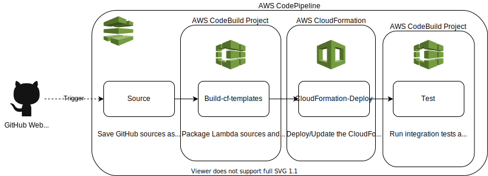

# Announcement microservice application CICD in AWS
The CICD pipeline for the applicaiton consists of the stages:
- GitHub Webhook
- Build
- Deploy
- Run tests



# How to deploy the CICD solution
1. Clone the repo
```
git clone https://github.com/vadymbat/aws-serverless-announcement-microservice.git \
    && cd aws-serverless-announcement-microservice
```

2. Configure access to AWS
```
export AWS_DEFAULT_REGION='eu-central-1'
export AWS_ACCESS_KEY_ID=''
export AWS_SECRET_ACCESS_KEY=''
export AWS_SESSION_TOKEN=''
```

3. Clean the Application resources (if deployed)
```
bash cleanup.sh
```

4. Set up GitHub personal token with read access to the repo and export it to the CLI
```
export GITHUB_PERSONAL_TOKEN=''
```

5. Deploy the CICD stack
```
bash cicd/cicd_setup.sh
```

# How to remove the resources
1. Configure access to AWS
```
export AWS_DEFAULT_REGION='eu-central-1'
export AWS_ACCESS_KEY_ID=''
export AWS_SECRET_ACCESS_KEY=''
export AWS_SESSION_TOKEN=''
```

2. Remove the application resources
```
bash -e cleanup.sh
```

3. Remove CICD infrastructure
```
bash -e cicd/cicd_cleanup.sh
```
